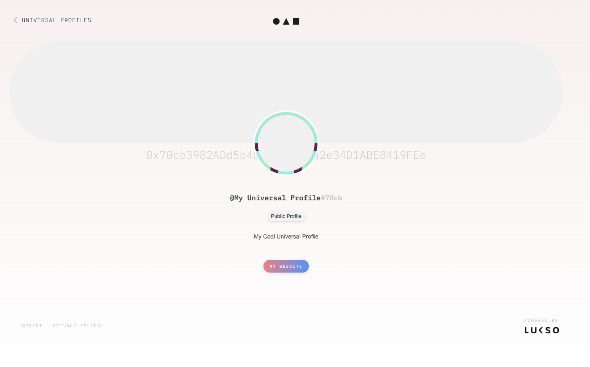
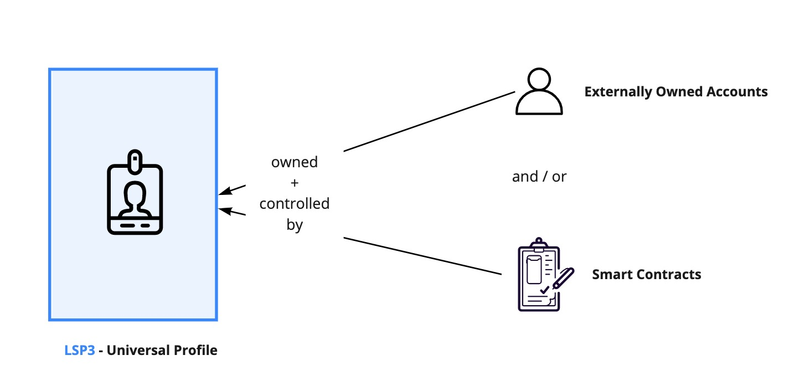
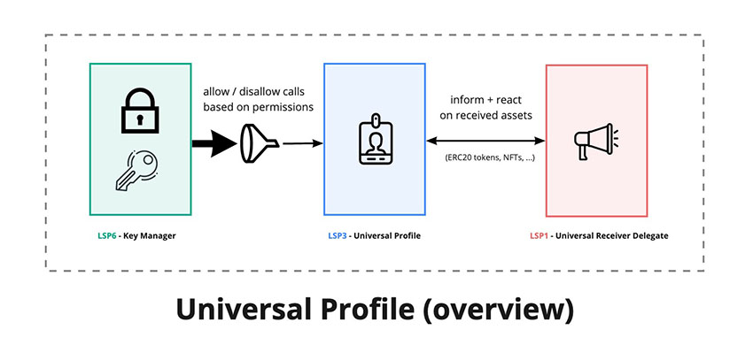
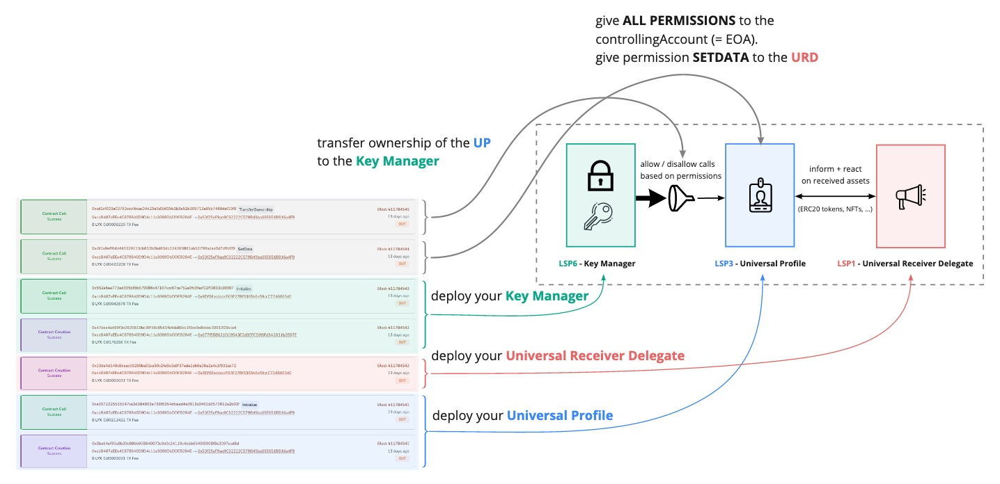

# Crear un Perfil Universal

:::tip
Un archivo JS completo _"listo para usar"_ está disponible al final en la sección [**Código Final**](#final-code). Si quieres ejecutar el código como archivos JavaScript independientes dentro de la terminal o el navegador, puedes abrir el repositorio [`lukso-playground`](https://github.com/lukso-network/lukso-playground) o utilizar la página correlacionada [StackBlitz](https://stackblitz.com/github/lukso-network/lukso-playground).
:::

En esta guía, aprenderemos cómo:

- crear un Perfil Universal.
- ver nuestro nuevo Perfil Universal en [l16.universalprofile.cloud](https://l16.universalprofile.cloud).



Utilizaremos la librería [lsp-factory.js](../../tools/lsp-factoryjs/deployment/universal-profile.md) para crear un Perfil Universal con **¡menos de 50 líneas de código!**.

## Introducción

### Contratos Propios

Un Perfil Universal es un **contrato inteligente propio**. Propiedad significa que un contrato de este tipo tiene un **propietario** independiente.

El propietario del Contrato es una `dirección` de blockchain que puede representar cualquier cosa, como:

- una o múltiples Cuentas de Propiedad Externa (EOAs),
- una cartera multisig, u
- otro contrato inteligente que puede representar cualquier cosa (una DAO, un DEX, etc...).



> Para más detalles, consulta [EIP-173: Estándar de Propiedad de Contratos](https://eips.ethereum.org/EIPS/eip-173)

Con el patrón de diseño **Ownable**, un contrato puede ser diseñado con _funcionalidades que sólo el propietario puede realizar_. El patrón de diseño proporciona al propietario del contrato más control y privilegios.

En el contexto del Perfil Universal, _cualquiera puede leer datos del almacenamiento del contrato_, pero **sólo el propietario puede**:

- setData(...)` = añadir, editar o eliminar datos del almacenamiento [ERC725Y](../../standards/universal-profile/lsp0-erc725account#erc725y---generic-key-value-store).
- "execute(...)` = transferir LYX a direcciones, llamar a otros contratos o crear y desplegar nuevos contratos (véase [ERC725X](../../standards/universal-profile/lsp0-erc725account#erc725x---generic-executor) executor)
- `transferOwnership(...)` = hacer que una dirección sea la nueva propietaria del Perfil Universal.

En esta guía, el propietario de nuestro Perfil Universal será un contrato llamado **Gestor de Claves**. El [Gestor de Claves](../../standards/smart-contracts/lsp6-key-manager.md) es un contrato inteligente que permite conceder permisos específicos a `direcciones`, para que puedan interactuar con el Perfil Universal. Por ejemplo, transferir LYX a nombre del Perfil Universal.

:::info Más información
Puedes implementar cualquier estructura compleja de propiedad (y control detallado) en los Perfiles Universales. La estructura incluye tener una UP propiedad de y controlada por:

- una o múltiples EOAs,
- uno o múltiples contratos inteligentes, o
- una mezcla de ambos.

Para más detalles, consulta [LSP6 - Estándar de Gestor de Claves].(../../standards/universal-profile/lsp6-key-manager.md).
:::

### Visión general de los contratos



La librería [lsp-factory.js](../../tools/lsp-factoryjs/getting-started.md) nos ayudará a desplegar y configurar rápidamente un Perfil Universal con unas pocas líneas de código.

Bajo el capó, lsp-factory.js realiza lo siguiente:

1. Implementa los contratos del Perfil Universal:
   - [Perfil Universal](../../standards/universal-profile/lsp0-erc725account.md) (UP) es el contrato inteligente central que representa un Perfil Universal.
   - [Gestor de Claves](../../standards/universal-profile/lsp6-key-manager.md) (KM) es el contrato que actúa como **propietario de un Perfil Universal** <br/>  para permitir que otras direcciones interactúen con el UP.
2. Vincula un contrato inteligente [Receptor Delegado Universal](../../standards/generic-standards/lsp1-universal-receiver-delegate.md) (URD) previamente implementado con el UP desplegado. El URD reacciona a eventos, como tokens recibidos o transferidos.
3. Configura todos los permisos para las direcciones EOA proporcionadas para que puedan actuar sobre la UP.

> :arrow_right: &nbsp; [Consulta nuestra documentación lsp-factory.js para más detalles](../../tools/lsp-factoryjs/getting-started)

:::info Más información
La figura anterior es nuestra Configuración por defecto para el Perfil Universal. Sin embargo, _utilizar un Gestor de Claves como propietario es opcional_.<br/>
También es posible crear un Perfil Universal sin un Gestor de Claves (o un Receptor Delegado Universal vinculado a él).
:::

## Configuración

Antes de empezar, crearemos una nueva carpeta de proyecto para escribir todo el código JavaScript de este tutorial. <br/>
Abre una terminal, luego crea y abre una nueva carpeta de proyecto.

```shell
mkdir myUP
cd myUP
```

Afterward, we have to install all the tools and libraries we need for this tutorial. <br/>
Copy and paste the command below in your terminal to install these as npm dependencies.

```shell
npm install web3 @lukso/lsp-factory.js --save
```

## Paso 1 - Crear una EOA

:::note Aviso
Debes hacer este paso en un **archivo temporal**.
:::

Como se describe en la introducción, nuestro primer paso es crear una EOA que se utilizará para controlar nuestro Perfil Universal.

Podemos crear fácilmente una EOA usando el método [`web3.eth.accounts.create()`](https://web3js.readthedocs.io/en/v1.5.2/web3-eth-accounts.html#create) de web3.js.

**Instrucciones:** **crea un archivo temporal** y añade el siguiente fragmento de código. Se generará un objeto que contiene:

- una clave privada (32 bytes / 64 caracteres de longitud),
- una dirección (20 bytes / 40 caracteres de longitud), y
- algunos métodos de firma como `sign`.

```javascript title="create-eoa.js (archivo temporal)"
import Web3 from 'web3';
const web3 = new Web3();

const myEOA = web3.eth.accounts.create();
console.log(myEOA);

/**
{
  address: "0x...",
  privateKey: "0x...",
  signTransaction: function(tx){...},
  sign: function(data){...},
  encrypt: function(password){...}
}
*/
```

Ejecuta el script anterior con Node.js para generar y mostrar tu clave privada y dirección EOA.

```bash
node create-eoa.js
```

> Consulta [Web3.js docs](https://web3js.readthedocs.io/en/v1.5.2/web3-eth-accounts.html#) para obtener más información sobre la creación de una EOA.

## Paso 2 - Obtener algo de LYX

Después de crear la EOA que controlará nuestro Perfil Universal en el **Paso 1**, necesitaremos financiar nuestra dirección con algunos LYX de prueba (la criptomoneda nativa de la blockchain LUKSO). Puedes obtener LYX de prueba gratis a través de **[Grifo L16](http://faucet.l16.lukso.network/)**.

**Instrucciones:** visita el sitio web del grifo y sigue las instrucciones para _solicitar LYX_.

:flecha_derecha: **[Página web del grifo LUKSO L16](http://faucet.l16.lukso.network/)**


Buscaremos el saldo de nuestra dirección en el **[Explorador de Bloques LUKSO L16](https://explorer.execution.l16.lukso.network/)** para asegurarnos de que hemos recibido nuestro LYX de prueba.

**Instrucciones:** ve al Explorador de Bloques LUKSO L16, y busca tu dirección en la esquina superior derecha.<br/> Deberías ver la cantidad de LYX solicitada junto al campo _Balance_.


## Paso 3 - Crear nuestro Perfil Universal

:::note Aviso
Deberías hacer el resto de este tutorial en un **nuevo archivo (`main.js`)**.
:::

Ahora que hemos creado nuestra EOA, estamos listos para crear nuestro primer Perfil Universal.

**Instrucciones:** crea un **nuevo archivo**: `main.js` (contendrá el script de ejecución principal para crear nuestro Perfil Universal).

### 3.1 - Cargar nuestra EOA

Empezaremos cargando nuestra EOA a nuestro archivo JS principal para que podamos usarla para desplegar nuestro Perfil Universal.

**Instrucciones:** importa la clave privada que creaste en el **paso 1**.

```javascript title="main.js"
import Web3 from 'web3';
const web3 = new Web3();

const PRIVATE_KEY = '0x...'; // tu clave privada de EOA (creada en el paso 1)
const myEOA = web3.eth.accounts.privateKeyToAccount(PRIVATE_KEY);

/**
{
  address: "0x...",
  privateKey: "0x...",
  signTransaction: function(tx){...},
  sign: function(data){...},
  encrypt: function(password){...}
}
*/
```

:::danger ¡Jamás expongas tu clave privada!

Tu clave privada es lo que te permite controlar a tu EOA. Por lo tanto, **NUNCA** debe ser expuesta.

Para mayor simplicidad, en este tutorial, cargamos la EOA utilizando una clave privada codificada (como una cadena literal).<br/>
Sin embargo, tu clave privada nunca debe ser ingresada en tu código.

:warning:**Asegúrate SIEMPRE de que tu clave privada está almacenada de forma segura** y de que nunca quede expuesta.

:::

### 3.2 - Configurar la lsp-factory.js

El siguiente paso es importar y configurar nuestra herramienta lsp-factory.js. Nos dará acceso a un método `.deploy(...)` que utilizaremos para crear nuestro Perfil Universal.

**Instrucciones:** utiliza el siguiente fragmento de código para configurar lsp-factory.js.

```javascript title="main.js"
import { LSPFactory } from '@lukso/lsp-factory.js';

// Paso 3.1 - Cargar nuestra EOA
const PRIVATE_KEY = '0x...'; // escribe aquí la clave privada de tu EOA (creada en el paso 1)
const myEOA = web3.eth.accounts.privateKeyToAccount(PRIVATE_KEY);

// inicializar el LSPFactory con el endpoint RPC de la cadena L16, chainId y la clave privada de la EOA que desplegará los contratos inteligentes UP
const lspFactory = new LSPFactory('https://rpc.l16.lukso.network', {
  deployKey: PRIVATE_KEY,
  chainId: 2828,
});
```

### 3.3 - Desplegar nuestro Perfil Universal

El paso final es desplegar nuestro UP llamando a `lspFactory.UniversalProfile.deploy(...)`. Este método desplegará y configurará los tres contratos principales mostrados en el [diagrama de arquitectura anterior](#contracts-overview).

La función `deploy` toma como argumento un objeto que contiene dos elementos:

- `controllerAddresses`: la(s) dirección(es) EOA que usaremos para controlar nuestra UP.
- `lsp3Profile`: un objeto que representa su [Metadatos `LSP3Profile`](../../standards/universal-profile/lsp3-universal-profile-metadata).

> En este tutorial mantendremos los metadatos de nuestro `LSP3Profile` sencillos. Pero puedes añadir fácilmente más detalles sobre tu UP tales como `profileImage`, `backgroundImage` y `avatar`. Puedes leer cómo hacer esto con lsp-factory [aquí].(../../tools/lsp-factoryjs/deployment/universal-profile.md#setting-images-in-lsp3metadata)

```javascript title="main.js"
import { LSPFactory } from '@lukso/lsp-factory.js';

// Paso 3.1 - Cargar nuestra EOA
// ...

// Paso 3.2 - Configurar la lsp-factory
// ...

// Step 3.3 - Paso 3.3 - Desplegar nuestro Perfil Universal
async function createUniversalProfile() {
  const deployedContracts = await lspFactory.UniversalProfile.deploy({
    controllerAddresses: [myEOA.address], // nuestra EOA que controlará la UP
    lsp3Profile: {
      name: 'Mi Perfil Universal',
      description: 'Mi Fantástico Perfil Universal',
      tags: ['Perfil Público'],
      links: [
        {
          title: 'Mi Sitio web',
          url: 'https://mi-sitio-web.com',
        },
      ],
    },
  });

  return deployedContracts;
}

createUniversalProfile().then((deployedContracts) => {
  console.log(deployedContracts);
});

/**
{
  LSP0ERC725Account: {
    address: '0x...',
    receipt: {
      to: null,
      from: '0x...',
      contractAddress: '0x...',
      blockNumber: ...,
      transactionHash: '0x...',
      gasUsed: [BigNumber],
      blockHash: '0x...',
      ...
    }
  },
  LSP6KeyManager: {
    address: '0x...',
    receipt: {
      ...
    }
  },
}
 */
```

:::info Más información
**Añadir más detalles** a nuestro Perfil Universal (_por ejemplo, enlaces, imágenes de perfil, imágenes de fondo_) será **nuestro próximo tutorial**. :art:
:::

## Visualizar nuestro nuevo Perfil Universal

Si el despliegue se ha realizado correctamente, podemos acceder a la dirección de nuestro recién creado Perfil Universal a partir del valor devuelto.

```javascript title="main.js"
async function createUniversalProfile() {
  const deployedContracts = await lspFactory.UniversalProfile.deploy({
    // los detalles de despliegue se omiten por brevedad
    // véase el paso 3.3
  });

  const myUPAddress = deployedContracts.LSP0ERC725Account.address;
  console.log('mi dirección de Perfil Universal: ', myUPAddress);
  // mi dirección de Perfil Universal: 0x...

  return deployedContracts;
}

createUniversalProfile();

// mi dirección de Perfil Universal: 0xEde1198b046d8ED64B71adeA5d3B7370cc84A7FB
```

También podemos visualizar nuestra UP en el sitio web [l16.universalprofile.cloud](https://l16.universalprofile.cloud) añadiendo la dirección de la UP desplegada en la URL, después de la `/` (barra), de la siguiente manera:

*https://l16.universalprofile.cloud/{tu-dirección-de-UP}*


También puedes ver los contratos creados por la librería lsp-factory.js en el explorador de bloques LUKSO L16:

*https://explorer.execution.l16.lukso.network/address/{tu-dirección-eoa}/transactions*

La siguiente figura describe cada transacción realizada por lsp-factory.js. También muestra cómo las transacciones son mapeadas al diagrama **[Visión general de los contratos](#contracts-overview)** introducido al principio de esta guía.



## Felicitaciones 🥳

**¡Has creado con éxito tu primer Perfil Universal!**

:arrow_right: Continúa con el siguiente tutorial para aprender **[Cómo editar tu Perfil Universal](./edit-profile.md)**.

:arrow_down: Mira el siguiente fragmento de código para ayudarte a depurar.

## Código final

A continuación se muestra el fragmento de código completo de esta guía, con todos los pasos compilados juntos.

```javascript title="crear-eoa.js"
import Web3 from 'web3';
const web3 = new Web3();

const myEOA = web3.eth.accounts.create();
console.log(myEOA);

/**
{
  address: "0x...",
    privateKey: "0x...",
    signTransaction: function(tx){...},
    sign: function(data){...},
    encrypt: function(password){...}
}
*/
```

```javascript title="main.js"
import Web3 from 'web3';
import { LSPFactory } from '@lukso/lsp-factory.js';

const web3 = new Web3();

// Paso 3.1 - Cargar nuestra Cuenta de Propiedad Externa (EOA)
const PRIVATE_KEY = '0x...'; // escribe aquí la clave privada de tu EOA (creada en el paso 1)
const myEOA = web3.eth.accounts.privateKeyToAccount(PRIVATE_KEY);

// Paso 3.2
// Inicializa el LSPFactory con el endpoint L16 RPC y la clave privada de la EOA que desplegará los contratos inteligentes UP.
const lspFactory = new LSPFactory('https://rpc.l16.lukso.network', {
  deployKey: PRIVATE_KEY,
  chainId: 2828,
});

// Paso 3.3 - Desplegar nuestro Perfil Universal
async function createUniversalProfile() {
  const deployedContracts = await lspFactory.UniversalProfile.deploy({
    controllerAddresses: [myEOA.address], // nuestra EOA que controlará la UP
    lsp3Profile: {
      name: 'Mi Perfil Universal',
      description: 'Mi Fantástico Perfil Universal',
      tags: ['Perfil Público'],
      links: [
        {
          title: 'Mi Sitio web',
          url: 'https://mi-sitio-web.com',
        },
      ],
    },
  });

  const myUPAddress = deployedContracts.LSP0ERC725Account.address;
  console.log('mi dirección de Perfil Universal: ', myUPAddress);

  return deployedContracts;
}

createUniversalProfile();

// mi dirección de Perfil Universal: 0xEde1198b046d8ED64B71adeA5d3B7370cc84A7FB
```
