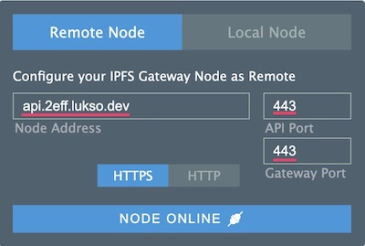
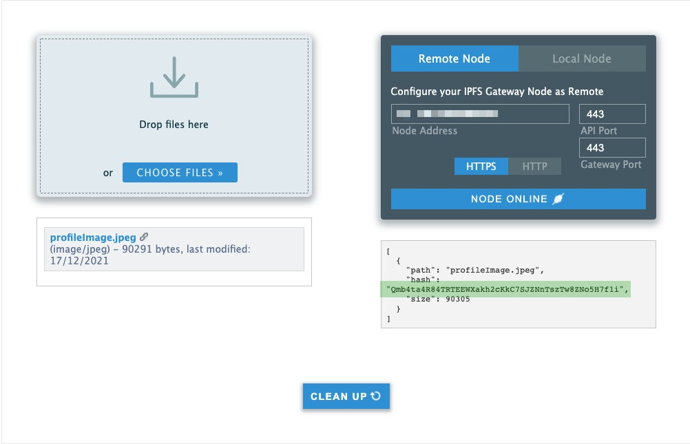

# Editar un Perfil Universal

:::info Requisitos

Para seguir esta guía necesitarás un Perfil Universal que puedas controlar a través de su Gestor de Claves. <br/>
:arrow_left: Si aún no tienes un Perfil Universal, sigue nuestra guía anterior [**Crear un Perfil Universal**](./create-profile.md).

:::

Esta guía nos enseñará como **personalizar nuestro Perfil Universal** programáticamente en JavaScript e incluye:

- añadir una foto de perfil y de portada a nuestro Perfil Universal,
- editar la información de nuestro Perfil Universal (por ejemplo, descripción, insignias, enlaces),
- visualizar los datos e imágenes actualizados de nuestro Perfil Universal en el sitio web [l16.universalprofile.cloud](https://l16.universalprofile.cloud).

Para alcanzar este objetivo, realizaremos los siguientes pasos:

1. Crear un archivo JSON que contenga los detalles de nuestro perfil (metadatos `LSP3Profile`).
2. Cargar este archivo JSON en [IPFS] utilizando nuestra herramienta [lsp-factory.js](../../tools/lsp-factoryjs/getting-started.md).
3. Cifrar + establecer nuestra nueva clave de metadatos [LSP3Profile](https://github.com/lukso-network/LIPs/blob/main/LSPs/LSP-3-UniversalProfile-Metadata.md#lsp3profile) en nuestro perfil con nuestra librería [erc725.js] y web3.js.

:::tip
Un archivo JS completo _"listo para usar"_ está disponible al final en la sección [**Código Final**](#final-code). Si deseas ejecutar el código como archivos JavaScript independientes dentro del terminal o del navegador, puedes abrir el repositorio [`lukso-playground`](https://github.com/lukso-network/lukso-playground) o utilizar la página relacionada [StackBlitz](https://stackblitz.com/github/lukso-network/lukso-playground).
:::


## Introducción

Un Perfil Universal es un contrato inteligente que utiliza un almacén genérico de valor-clave (ERC725Y) como diseño de almacenamiento. La estructura hace posible adjuntar cualquier pieza de información a nuestro Perfil Universal estableciendo cualquier **valor** particular a cualquier **clave** específica.

Un conjunto de claves de datos ERC725Y se define como un **esquema ERC725Y**. El esquema es una matriz de claves, donde un objeto representa cada clave. Cada uno de los objetos describe el `nombre` de la clave, el `tipo de clave` (_e.g., monotón, matriz, asignación_), y el tipo de datos que contiene (`tipo de valor`).

Un esquema nos permite saber qué claves de datos ERC725Y podemos establecer y **qué información podemos recuperar y editar desde nuestro Perfil Universal**.


> Para más detalles, consulta: [LSP2 - ERC725Y JSON Schema](https://github.com/lukso-network/LIPs/blob/main/LSPs/LSP-2-ERC725YJSONSchema.md#specification)

Una de las principales claves de datos ERC725Y del Perfil Universal es la clave [`LSP3Profile`](https://github.com/lukso-network/LIPs/blob/main/LSPs/LSP-3-UniversalProfile-Metadata.md#lsp3profile). Se trata de una clave estandarizada que hace referencia a los **metadatos del Perfil Universal**. Estos metadatos adoptan la forma de una referencia a un archivo JSON.

Esta guía almacenará los metadatos de nuestro Perfil Universal en [IPFS], un almacenamiento de archivos distribuido.

Podemos añadir (o editar) cualquier pieza de información relacionada con nuestro UP mediante los siguientes pasos:

1. Crea un nuevo archivo JSON con información nueva o actualizada.
2. Carga el archivo en IPFS.
3. Cambia la referencia de nuestra clave [LSP3Profile](https://github.com/lukso-network/LIPs/blob/main/LSPs/LSP-3-UniversalProfile-Metadata.md#lsp3profile) para que apunte a nuestro archivo JSON cargado.

Metadatos [LSP3Profile como archivo JSON en IPFS (diagrama)](./img/profile-metadata-ipfs-explained.jpeg)

:::info Más información
**IPFS es sólo un lugar entre muchos** donde puedes almacenar los metadatos de tu Perfil Universal.<br/>
Puedes utilizar otras opciones de almacenamiento de archivos para guardar tu archivo JSON (_e.g., [Swarm](https://www.ethswarm.org/), [Storj](https://www.storj.io/index.html), Google Drive, o un servidor FTP privado_).
:::

## Configuración

Configura un nuevo proyecto con:

```shell
npm init
```

Puedes mantener todos los valores predeterminados.

A continuación, instala las dependencias, utilizaremos una nueva herramienta en esta guía: [erc725.js]:

```shell
npm install web3 @lukso/lsp-factory.js @lukso/lsp-smart-contracts @erc725/erc725.js
```

## Paso 1 - Crear un nuevo archivo JSON LSP3Profile

:::successRecomendación
Los archivos JSON y JS completos "listos para usar" están disponibles al final en la sección [**Código final**](#final-code).
:::

Empezaremos creando un **nuevo archivo JSON** que contendrá nuestros metadatos `LSP3Profile`.

Utiliza el archivo de plantilla JSON de abajo, y sigue los **pasos 1.1 y 1.2** para rellenar los campos en blanco marcados con puntos.

```json title="UniversalProfileMetadata.json"
{
  "LSP3Profile": {
    "name": "...", // un nombre de usuario elegido por ti mismo
    "description": "...", // Una descripción de la persona, empresa, organización o creador del perfil.
    "links": [
      // enlaces asociados al perfil
      {
        "title": "...", // un título para el enlace.
        "url": "..." // el enlace en sí
      }
      // agrega más enlaces...
    ],
    "tags": ["...", "..."], // etiquetas asociadas al perfil
    "profileImage": [
      {
        "width": 640, // en pixeles
        "height": 609, // en pixeles
        "hashFunction": "keccak256(bytes)", // ¡no lo cambies!
        "hash": "0x...", // agrega aquí el hash keccak256 de la imagen
        "url": "ipfs://..." // Identificador de imagen IPFS (CID)
      }
    ],
    "backgroundImage": [
      {
        "width": 1024, // en pixeles
        "height": 576, // en pixeles
        "hashFunction": "keccak256(bytes)", // ¡no lo cambies!
        "hash": "0x...", // agrega aquí el hash keccak256 de la imagen
        "url": "ipfs://..." // Identificador de imagen IPFS (CID)
      }
    ]
  }
}
```

### 1.1 - Añadir detalles del perfil (enlaces, etiquetas, etc.)

Puedes agregar más detalles sobre el Perfil Universal para el nombre de la entidad, la descripción, los enlaces y las etiquetas.

¡Se tan creativo como quieras para hacer tu Perfil Universal tan único como sea posible! :art:

:::infoMás información
Las propiedades `links` y `tags` aceptan un conjunto de objetos o cadenas, ¡así que puedes añadir tantos como necesites!

Para editar las propiedades `profileImage` y `backgroundImage`, consulta **Paso 1.2** más abajo :arrow_down:
:::

### 1.2 - Añadir una imagen de perfil y de fondo

:::caution
Los tamaños de imagen deben escribirse como números, no como cadenas.

El **ancho máximo de imagen** permitido en [universalprofile.cloud](https://universalprofile.cloud) es: `profileImage <= 800px`, `backgroundImage <= 1800px`
:::

:::info
El archivo JSON para LSP3Profile acepta una matriz de imágenes para que tenga imágenes de diferentes tamaños y dimensiones.<br/>
De esta manera, las interfaces de cliente pueden saber qué archivos elegir en función del tamaño del contenedor en su interfaz.
:::

Para las propiedades `profileImage` y `backgroundImage`, necesitaremos añadir la siguiente información:

- `hash`: usa este **[generador de hash de imagen keccak256](https://emn178.github.io/online-tools/keccak_256_checksum.html)**.
- `url`: sube tus imágenes a la Pasarela IPFS de LUKSO.

Utiliza esta [herramienta de carga de archivos IPFS](https://anarkrypto.github.io/upload-files-to-ipfs-from-browser-panel/public/#) con la configuración que se muestra a continuación en verde.

- Dirección del nodo: `api.2eff.lukso.dev`
- Puerto API / Puerto Gateway: `443`.



Arrastra y suelta tus imágenes (puedes subir varias imágenes a la vez) y _súbelas_. Una vez completado el proceso

1. Copia el identificador de archivo IPFS (`CID`) que se muestra en el campo `hash` marcado en verde más abajo.
2. Pega el `CID` en el campo `url` de nuestro archivo JSON, empezando por `ipfs://` al principio.



Asegúrate de guardar tu archivo JSON después de haber añadido todos tus datos e imágenes.

:::note
No olvides borrar los comentarios del archivo JSON.
:::

Ya estamos listos para aplicar estos cambios a nuestro Perfil Universal. Veremos cómo en la siguiente sección :arrow_down:

## Paso 2 - Subir el archivo JSON a IPFS

:::note Aviso
El resto de este tutorial debe hacerse en un **nuevo archivo** (`main.js`).
:::

Ahora empezaremos a escribir el código principal del tutorial.
Crea un nuevo archivo, `main.js`.

Nuestra herramienta [lsp-factory.js](../../tools/lsp-factoryjs/getting-started.md) proporciona comodidad para subir nuestros Metadatos de perfil a IPFS.

```javascript title="main.js"
import { LSPFactory } from '@lukso/lsp-factory.js';
// referencia al archivo JSON creado previamente (metadatos LSP3Profile)
import jsonFile from './UniversalProfileMetadata.json';

const provider = 'https://rpc.l16.lukso.network'; // URL del proveedor de RPC

const lspFactory = new LSPFactory(provider, {
  deployKey: PRIVATE_KEY,
  chainId: 2828, // Id de cadena de la red en la que desea desplegar
});

async function editProfileInfo() {
  // Paso 2 - Subir nuestro archivo JSON a IPFS
  const uploadResult = await lspFactory.UniversalProfile.uploadProfileData(
    jsonFile.LSP3Profile,
  );
  const lsp3ProfileIPFSUrl = uploadResult.url;
  // ipfs://Qm...
}
```

## Paso 3 - Configurar erc725.js y cifrar los datos de LSP3Profile

El siguiente paso es **preparar los datos** utilizados para editar nuestro Perfil Universal. _Preparar los datos_ significa **cifrarlos** para escribirlos en nuestro contrato inteligente ERC725Y de Perfil Universal.

Para ello, utilizaremos nuestra librería [erc725.js], que nos ayuda a cifrar los datos fácilmente.

Para configurar la librería erc725.js, necesitaremos lo siguiente:

- La dirección de nuestro contrato de Perfil Universal: es la dirección de nuestro perfil mencionada en la URL del [explorador de perfiles](https://l16.universalprofile.cloud/).
- Un esquema JSON ERC725Y: un conjunto de pares clave-valor ERC725Y ([LSP2 - Esquema JSON ERC725Y](https://github.com/lukso-network/LIPs/blob/main/LSPs/LSP-2-ERC725YJSONSchema.md))
- Un proveedor RPC: `https://rpc.l16.lukso.network`

Una vez inicializado nuestro erc725.js, podemos cifrar los datos del `LSP3Profile` para generar una clave y un valor.

Para ello, utilizamos la función [`encodeData()`](../../tools/erc725js/classes/ERC725.md#encodeData). La llamamos con un objeto que contiene el `keyName` y el `value`:

- `keyName`: `LSP3Profile`, el nombre de la clave que queremos cifrar.
- `value`: un objeto con:
  - `hashFunction`: usamos `keccak256` (función hash estándar). Como estamos haciendo hashing en un fichero JSON que contiene cadenas, también especificamos el tipo de datos como `utf8`.
  - hash:` obtenido tras aplicar la función hash `keccak256` al fichero JSON.
  - `url` del archivo: es la URL IPFS del archivo, obtenida en el **paso 2.**.

En el **mismo archivo**, `main.js`, configura la librería erc725.js.

```javascript title="main.js"
import Web3 from 'web3';
// importar ERC725
import { ERC725 } from '@erc725/erc725.js';
// ...

const web3 = new Web3('https://rpc.l16.lukso.network');

// Paso 1 - Crear un nuevo archivo JSON LSP3Profile
// ...

async function editProfileInfo() {
  // Paso 2 - Subir nuestro archivo JSON a IPFS
  // ...

  // Paso 3.1 - Configurar erc725.js
  const schema = [
    {
      name: 'LSP3Profile',
      key: '0x5ef83ad9559033e6e941db7d7c495acdce616347d28e90c7ce47cbfcfcad3bc5',
      keyType: 'Singleton',
      valueContent: 'JSONURL',
      valueType: 'bytes',
    },
  ];

  const erc725 = new ERC725(schema, profileAddress, web3.currentProvider, {
    ipfsGateway: 'https://2eff.lukso.dev/ipfs/',
  });

  // Paso 3.2 - Cifrar los datos del LSP3Profile
  const encodedData = erc725.encodeData({
    keyName: 'LSP3Profile',
    value: {
      hashFunction: 'keccak256(utf8)',
      // hash our LSP3 metadata JSON file
      hash: web3.utils.keccak256(JSON.stringify(uploadResult.json)),
      url: lsp3ProfileIPFSUrl,
    },
  });
  /**
  { ejemplo de claves y valores basados en la l14
    keys: ['0x5ef83ad9559033e6e941db7d7c495acdce616347d28e90c7ce47cbfcfcad3bc5'],
    values: ['0x6f357c6aabbbf0d07b125d2c53c1ca19672e31ad768d8fd2ca55fbf0a6e94a39488a52c5697066733a2f2f516d59435154653572355a6556546274705a4d5a58535150324e785864674a46565a623631446b33674650355658']
  }
  */
}
```

## Paso 4 - Editar el Perfil Universal

Ahora que nuestros datos actualizados están cifrados, estamos listos para establecerlos en nuestro contrato inteligente de Perfil Universal. Para ello, interactuaremos con nuestro contrato inteligente Perfil Universal a través de Web3.js.

### 4.1 - Cargar una EOA

Necesitaremos interactuar con los contratos inteligentes desde una cuenta de propiedad externa (EOA).

El primer paso es cargar nuestra EOA utilizando nuestra clave privada de [pasos anteriores](./create-profile#step-1---create-an-eoa).

```javascript title="Cargar cuenta a partir de una clave privada"
import Web3 from 'web3';
const web3 = new Web3('https://rpc.l16.lukso.network');

const PRIVATE_KEY = '0x...'; // tu clave privada EOA (creada previamente)

const myEOA = web3.eth.accounts.wallet.add(PRIVATE_KEY);
```

### 4.2 - Crear instancias de Contratos

El primer paso es crear nuevas instancias del Perfil Universal y de los contratos inteligentes [Gestor de Claves](../../standards/smart-contracts/lsp6-key-manager). Vamos a necesitar:

- las ABIs de los contratos (de nuestro paquete npm [`@lukso/lsp-smart-contracts`](https://www.npmjs.com/package/@lukso/lsp-smart-contracts)).
- las direcciones del contrato.

Si has desplegado tu Perfil Universal con nuestra herramienta [lsp-factory.js](./create-profile.md) (como en nuestra guía anterior), el propietario de la UP apuntará a la dirección del Gestor de Claves.

Por lo tanto, puedes obtener rápidamente la dirección de tu Gestor de Claves llamando a la función [`owner()`](../../standards/smart-contracts/lsp0-erc725-account.md#owner) en el contrato inteligente de tu Perfil Universal.

```javascript title="Crear instancias de contratos y obtener la dirección del Gestor de Claves"
import Web3 from 'web3';
import UniversalProfile from '@lukso/lsp-smart-contracts/artifacts/UniversalProfile.json';
import KeyManager from '@lukso/lsp-smart-contracts/artifacts/LSP6KeyManager.json';

const web3 = new Web3('https://rpc.l16.lukso.network');

// crea una instancia de tu Perfil Universal
const universalProfileContract = new web3.eth.Contract(
  UniversalProfile.abi,
  profileAddress,
);

// si se despliega con lsp-factory.js,
// el Gestor de Claves es el propietario del UP,
// así que recupera la dirección de tu Gestor de Claves mediante `owner()` (= función getter)
const keyManagerAddress = await universalProfileContract.methods.owner().call();
const keyManagerContract = new web3.eth.Contract(
  KeyManager.abi,
  keyManagerAddress,
);
```

### 4.3 - Establecer datos en el Perfil Universal

El paso final es editar nuestra clave `LSP3Profile` en nuestro Perfil Universal con el nuevo valor obtenido en el **Paso 3**. Podemos acceder fácilmente al par clave-valor desde los datos cifrados obtenidos con erc725.js.

Dado que un Gestor de Claves es el propietario de nuestro Perfil Universal, la llamada comprobará primero los permisos a través del Gestor de Claves. A continuación, tenemos que **cifrar** la carga útil `setData` y pasarla a al contrato inteligente de nuestro Perfil Universal para realizar este último paso.

```javascript title="Preparación y ejecución de la transacción setData"
// cifrar la carga útil de setData
// (`encodedData` es el valor obtenido en el paso 3.2)
const abiPayload = await universalProfileContract.methods[
  'setData(bytes32[],bytes[])'
](encodedData.keys, encodedData.values).encodeABI();

// ejecutar a través del Gestor de Claves, pasando la carga útil del UP
await keyManagerContract.methods
  .execute(abiPayload)
  .send({ from: myEOA.address, gasLimit: 300_000 });
```

## Código final

A continuación se muestra el fragmento de código completo de esta guía, con todos los pasos compilados juntos.

<details>
    <summary><code>UniversalProfileMetadata.json</code> (ejemplo) - haz clic para ampliar</summary>

```json
{
  "LSP3Profile": {
    "name": "Perfil LUKSO - Primeros Pasos",
    "description": "¡Felicidades! Has editado con éxito tu perfil y has completado el paso 2 de la Guía de Introducción. 😃",
    "links": [
      {
        "title": "sitio web",
        "url": "https://misitioweb.me"
      }
    ],
    "tags": ["Perfil Público"],
    "profileImage": [
      {
        "width": 640,
        "height": 609,
        "hashFunction": "keccak256(bytes)",
        "hash": "0xe459e5769af85b09fb43bb8eaac561e196d58c0f5da3c5e150b6695898089402",
        "url": "ipfs://QmPCz896rcZmq8F3FuUkJinRUmPgnZGjPvZL71nAaL7Fsx"
      }
    ],
    "backgroundImage": [
      {
        "width": 1024,
        "height": 576,
        "hashFunction": "keccak256(bytes)",
        "hash": "0x1c19780d377a7b01f7dcf16e0ebffd225e29d2235625009f67cf9d86a32a79e1",
        "url": "ipfs://QmPMmEpKnmgACsWjhDUheF8TEKpspzQhAkjbY4EBbR4jgP"
      }
    ]
  }
}
```

</details>

```javascript title="main.js"
import Web3 from 'web3';
import { ERC725 } from '@erc725/erc725.js';
import { LSPFactory } from '@lukso/lsp-factory.js';

import UniversalProfile from '@lukso/lsp-smart-contracts/artifacts/UniversalProfile.json';
import KeyManager from '@lukso/lsp-smart-contracts/artifacts/LSP6KeyManager.json';

import jsonFile from './UniversalProfileMetadata.json';

const web3 = new Web3('https://rpc.l16.lukso.network');

// constantes
const PRIVATE_KEY = '0x...';
const profileAddress = '0x...';

// Paso 1 - Crear un nuevo archivo JSON LSP3Profile

const provider = 'https://rpc.l16.lukso.network'; // URL del proveedor RPC

const lspFactory = new LSPFactory(provider, {
  deployKey: PRIVATE_KEY,
  chainId: 2828, // Id de cadena de la red en la que desea desplegar
});

async function editProfileInfo() {
  // Paso 2 - Subir nuestro archivo JSON a IPFS
  const uploadResult = await lspFactory.UniversalProfile.uploadProfileData(
    jsonFile.LSP3Profile,
  );
  const lsp3ProfileIPFSUrl = uploadResult.url;
  // 'ipfs://QmYCQTe5r5ZeVTbtpZMZXSQP2NxXdgJFVZb61Dk3gFP5VX'

  // Paso 3.1 - Configurar erc725.js
  const schema = [
    {
      name: 'LSP3Profile',
      key: '0x5ef83ad9559033e6e941db7d7c495acdce616347d28e90c7ce47cbfcfcad3bc5',
      keyType: 'Singleton',
      valueContent: 'JSONURL',
      valueType: 'bytes',
    },
  ];

  const erc725 = new ERC725(schema, profileAddress, web3.currentProvider, {
    ipfsGateway: 'https://2eff.lukso.dev/ipfs/',
  });

  // Paso 3.2 - Cifrar los datos del LSP3Profile (to be written on our UP)
  const encodedData = erc725.encodeData({
    keyName: 'LSP3Profile',
    value: {
      hashFunction: 'keccak256(utf8)',
      // hash de nuestro archivo JSON de metadatos LSP3
      hash: web3.utils.keccak256(JSON.stringify(uploadResult.json)),
      url: lsp3ProfileIPFSUrl,
    },
  });

  // Paso 4.1 - Cargar nuestra EOA
  const myEOA = web3.eth.accounts.wallet.add(PRIVATE_KEY);
  console.log('EOA:', myEOA.address);

  // Paso 4.2 - Crear instancias de nuestros Contratos
  const universalProfileContract = new web3.eth.Contract(
    UniversalProfile.abi,
    profileAddress,
  );

  const keyManagerAddress = await universalProfileContract.methods
    .owner()
    .call();
  const keyManagerContract = new web3.eth.Contract(
    KeyManager.abi,
    keyManagerAddress,
  );

  // Paso 4.3 - Establecer datos (metadatos LSP3Profile actualizados) en nuestro Perfil Universal

  // cifrar la carga útil setData
  const abiPayload = await universalProfileContract.methods[
    'setData(bytes32[],bytes[])'
  ](encodedData.keys, encodedData.values).encodeABI();

  // ejecutar a través del Gestor de Claves, pasando la carga útil del UP
  await keyManagerContract.methods
    .execute(abiPayload)
    .send({ from: myEOA.address, gasLimit: 300_000 });
}
editProfileInfo();
```

## Visualiza nuestro Perfil Universal actualizado

Ahora puede verificar el Perfil Universal en el sitio web [explorador de perfiles](https://l16.universalprofile.cloud/) pegando la dirección devuelta después de la barra de la URL base:

`https://l16.universalprofile.cloud/[DIRECCIÓN UP]`


[erc725.js]: ../../tools/erc725js/getting-started
[ipfs]: https://ipfs.io/
