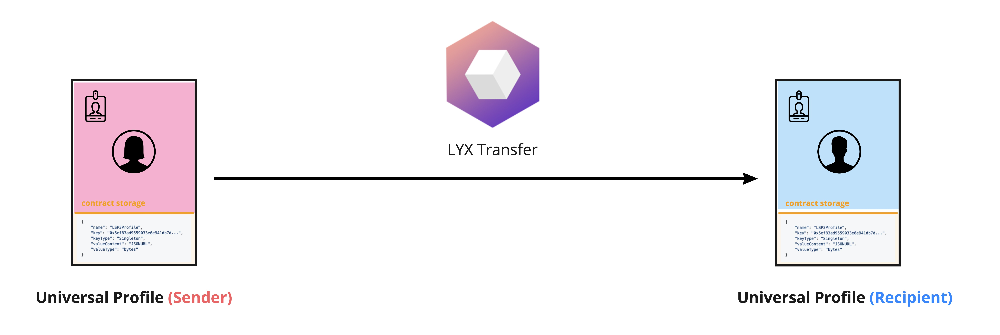
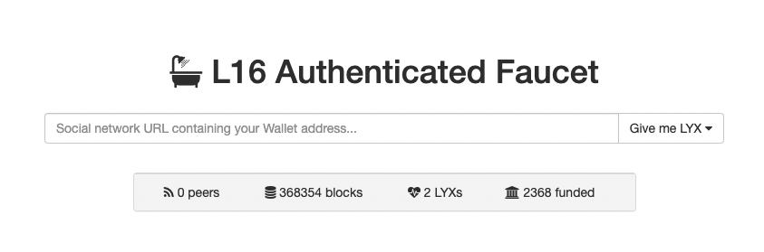
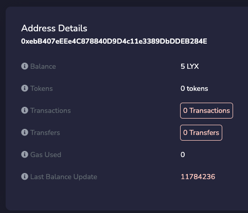

import Tabs from '@theme/Tabs';
import TabItem from '@theme/TabItem';

# Transferir LYX

En esta guía, aprenderemos **cómo transferir LYX** desde nuestro Perfil Universal a cualquier `dirección` (incluyendo otra :up: ). Abordaremos:

- lo básico de la función `execute(...)` y cómo funciona.
- cómo usar esta función para transferir LYX desde nuestro UP.



:::tip
Un archivo JS completo _"listo para usar"_ está disponible al final en la sección [**Código Final**](#final-code). Si deseas ejecutar el código como archivos JavaScript independientes dentro de la terminal o el navegador, puedes abrir el repositorio [`lukso-playground`](https://github.com/lukso-network/lukso-playground) o utilizar la página asociada [StackBlitz](https://stackblitz.com/github/lukso-network/lukso-playground). Recuerda que tendrás que proporcionar una clave de controlador (EOA) de tu perfil universal para poder transferir fondos.
:::

## Introducción

Recapitulemos lo que hemos aprendido hasta ahora.

- En nuestra guía [**Crear un Perfil Universal**](./create-profile.md), vimos en el [Diagrama de arquitectura del Perfil Universal](./create-profile.md#contracts-overview) que el propietario de un Perfil Universal (UP) es un Gestor de Claves (KM). Este contrato inteligente actúa como su controlador.

- En nuestra guía [**Editar un Perfil Universal**](./edit-profile.md), se explicaba cómo interactuar con nuestro UP para editar la información de nuestro perfil. Lo hicimos interactuando a través del KM.

Anteriormente, vimos cómo utilizar `setData(...)` para actualizar los datos en el almacenamiento de nuestro contrato UP. Veamos ahora `execute(...)`.

### Conceptos básicos de la función `execute(...)`.

La función [`execute(operation,to,value,data)`](../../standards/smart-contracts/erc725-contract.md#execute---erc725x) de [ERC725X](../../standards/lsp-background/erc725.md#erc725x---generic-executor) nos permite utilizar nuestra UP para interactuar con otras direcciones, como transferir LYX o llamar a otros contratos inteligentes. Esta función toma cuatro argumentos (ver [ERC725 API docs](../../standards/smart-contracts/erc725-contract.md#execute---erc725x)).

Podemos usar esta función para transferir LYX desde nuestra UP a cualquier dirección (incluyendo otra UP). Transferir LYX desde nuestra UP es tan simple como hacer una [`CALL`] estándar(../../standards/universal-profile/lsp6-key-manager.md#permission-values) a cualquier `address`, adjuntando algún **valor** a la llamada.

Para una transferencia LYX normal, los parámetros serán:

- `_operation`: `0` (para `CALL`).
- `_to`: la `dirección` a la que queremos enviar LYX (Cuenta de Propiedad Externa o dirección de contrato).
- `_value`: la cantidad de LYX que queremos transferir (en Wei).
- `_data`: vacío (`0x` ya que sólo estamos transfiriendo LYX).

### Interactuar a través del Gestor de Claves

La mayoría de las funciones del contrato UP, como [`setData(...)`](../../standards/smart-contracts/erc725-contract.md#setdata---erc725y) y [`execute(...)`](.. /../standards/smart-contracts/erc725-contract.md#execute---erc725x) sólo pueden ser llamados por el [`owner`](../../standards/smart-contracts/erc725-contract.md#owner). Por lo tanto, si queremos utilizar nuestra UP para hacer cosas significativas, **todas las interacciones deben pasar por el KM**.


Para transferir LYX desde nuestra UP, necesitamos realizar los siguientes pasos:

1. Cifrar ABI la llamada a la función [`execute(operation,to,value,data)`](../../standards/smart-contracts/erc725-contract.md#execute---erc725x) de nuestra UP.
2. pasar los **calldata** cifrados ABI a la función [`execute(calldata)`](../../standards/smart-contracts/lsp6-key-manager.md#execute) del KM.

:::info

Asegúrate de entender la diferencia entre ambas funciones `execute(...)`.

- `execute(operation,to,value,data)`](../../standards/smart-contracts/erc725-contract.md#execute---erc725x) del Perfil Universal = función ejecutora genérica utilizada para llamar e interactuar con EOAs o contratos + desplegar nuevos contratos desde el UP.
- `execute(calldata)` desde el Gestor de Claves = se utiliza para ejecutar funciones en el Perfil Universal vinculadas al Gestor de Claves (mediante el reenvío de calldata cifrada ABI), a la vez que se verifica si la persona que llama tiene los permisos adecuados para hacerlo.

:::

## Configuración

Para completar esta mini-guía, necesitaremos:

- los contratos ABI `UniversalProfile` y `KeyManager` del paquete npm [`@lukso/lsp-smart-contracts`](https://www.npmjs.com/package/@lukso/lsp-smart-contracts).
- la dirección de nuestro Perfil Universal, desde la que queremos enviar LYX.
- una EOA con algunos LYX para las cuotas de gas y los [**permisos**] necesarios(../../standards/universal-profile/lsp6-key-manager.md#permissions) para la interacción.

:::info

La EOA que se elija debe tener [**TRANSFERVALUE Permission**](../../standards/universal-profile/lsp6-key-manager.md#permissions) junto con [**AllowedCalls**](../.. /standards/universal-profile/lsp6-key-manager.md#allowed-calls) o [**SUPER_TRANSFERVALUE Pemrission**](../../standards/universal-profile/lsp6-key-manager.md#super-permissions)

:::

Asegúrate de tener instaladas las siguientes dependencias antes de empezar este tutorial:

- O bien [`web3.js`](https://github.com/web3/web3.js) o bien [`ethers.js`](https://github.com/ethers-io/ethers.js/)
- [`@lukso/lsp-smart-contracts`](https://github.com/lukso-network/lsp-smart-contracts/)

<Tabs>
  
  <TabItem value="web3js" label="web3.js">

```shell title="Instala las dependencias"
npm install web3 @lukso/lsp-smart-contracts
```

  </TabItem>

  <TabItem value="ethersjs" label="ethers.js">

```shell title="Instala las dependencias"
npm install ethers @lukso/lsp-smart-contracts
```

  </TabItem>

</Tabs>

## Paso 1 - Consigue un poco de LYX

:::caution

Necesitas tener LYX tanto en tu EOA (que pagará las cuotas de transacción) como en tu Perfil Universal (desde donde se transferirá el LYX).

:::

Para poder enviar LYX desde nuestro Perfil Universal, primero solicitaremos algunos LYX de prueba gratuitos para nuestra UP a través del **[Grifo L16](https://faucet.l16.lukso.network/)**.

1. Visita la página :arrow_right: **[Sitio web del grifo LUKSO L16](https://faucet.l16.lukso.network/)**.
2. Haz un **[tweet](https://twitter.com)** con tu dirección UP y pega la url del tweet en el formulario y haz clic en el botón _"Give me LYX"_.



3. Comprueba el saldo de tu Perfil Universal en el **[Explorador de Bloques LUKSO L16](https://explorer.execution.l16.lukso.network/)** :arrow_down:

Pega la dirección del Perfil Universal en el campo de dirección de la esquina superior derecha del explorador de bloques.

Si todo ha ido bien, deberías ver que el campo _"Balance"_ de tu Perfil Universal se ha actualizado.



## Paso 2 - Crear las instancias de los contratos

El primer paso es crear instancias de nuestros contratos Perfil Universal y Gestor de Claves.

- 2.1 - En primer lugar, utilizaremos el Perfil Universal para conseguir la dirección del Gestor de Llaves a través de la función [`owner()`](../../standards/smart-contracts/lsp0-erc725-account.md#owner).

- 2.2 - A continuación, utilizaremos el Gestor de Claves para interactuar con nuestro Perfil Universal y enviar algunos LYX.

<Tabs>
  
  <TabItem value="web3js" label="web3.js">

```typescript
import UniversalProfile from '@lukso/lsp-smart-contracts/artifacts/UniversalProfile.json';
import KeyManager from '@lukso/lsp-smart-contracts/artifacts/LSP6KeyManager.json';
import Web3 from 'web3';

const web3 = new Web3('https://rpc.l16.lukso.network');

const myUPAddress = '0x...';
const myUP = new web3.eth.Contract(UniversalProfile.abi, myUPAddress);

// el Gestor de Claves es el propietario del Perfil Universal
// por lo que podemos llamar a la función owner() para obtener la dirección del contrato del Gestor de Claves
const owner = await myUP.methods.owner().call();
const myKM = new web3.eth.Contract(KeyManager.abi, owner);
```

  </TabItem>

  <TabItem value="ethersjs" label="ethers.js">

```typescript
import UniversalProfile from '@lukso/lsp-smart-contracts/artifacts/UniversalProfile.json';
import KeyManager from '@lukso/lsp-smart-contracts/artifacts/LSP6KeyManager.json';
import { ethers } from 'ethers';

const provider = new ethers.JsonRpcProvider('https://rpc.l16.lukso.network');

const myUPAddress = '0x...';
const myUP = new ethers.Contract(myUPAddress, UniversalProfile.abi, provider);

// el Gestor de Claves es el propietario del Perfil Universal
// por lo que podemos llamar a la función owner() para obtener la dirección del contrato del Gestor de Claves
const owner = await myUP.owner();
const myKM = new ethers.Contract(owner, KeyManager.abi, provider);
```

  </TabItem>

</Tabs>

## Paso 3 - Cifrar los calldata para transferir LYX

Con nuestras instancias de contrato listas, ahora queremos transferir algunos LYX desde la UP usando la función `execute(...)`.
El siguiente paso es cifrar ABI esta llamada de función con los parámetros correctos, como se explica en la introducción.

Podemos usar el método [`encodeABI()`](https://web3js.readthedocs.io/en/v1.7.4/web3-eth-contract.html#methods-mymethod-encodeabi) de web3.js

<Tabs>
  
  <TabItem value="web3js" label="web3.js">

```typescript
const OPERATION_CALL = 0;
const recipient = '0x...'; // dirección del destinatario (cualquier dirección, incluida otra UP)
const amount = web3.utils.toWei('3'); // cantidad de LYX que queremos transferir
// calldata ejecutada en el destino (aquí nada, una simple transferencia LYX)
const data = '0x';

// cifrar los calldata para transferir 3 LYX desde el UP
const transferLYXCalldata = await myUP.methods[
  'execute(uint256,address,uint256,bytes)'
](OPERATION_CALL, recipient, amount, data).encodeABI();
```

  </TabItem>

  <TabItem value="ethersjs" label="ethers.js">

```typescript
const OPERATION_CALL = 0;
const recipient = '0x...'; // dirección del destinatario (cualquier dirección, incluida otra UP)
const amount = ethers.parseEther('3'); // cantidad de LYX que queremos transferir
const data = '0x'; // calldata ejecutada en el destino (aquí nada, una simple transferencia LYX)

// cifrar los calldata para transferir 3 LYX desde el UP
const transferLYXCalldata = myUP.interface.encodeFunctionData(
  'execute(uint256,address,uint256,bytes)',
  [OPERATION_CALL, recipient, amount, data],
);
```

  </TabItem>

</Tabs>

## Paso 4 - Ejecutar a través del Gestor de Claves

### Cargar nuestra EOA

Como en otras guías, un paso importante es cargar la EOA que es un controlador para nuestro Perfil Universal. En este caso la dirección del controlador debe tener [**TRANSFERVALUE Permission**](../../standards/universal-profile/lsp6-key-manager.md#permissions) junto con [**AllowedCalls**](../.. /standards/universal-profile/lsp6-key-manager.md#allowed-calls) o [**SUPER_TRANSFERVALUE Pemrission**](../../standards/universal-profile/lsp6-key-manager.md#super-permissions) para que la transacción se realice correctamente.

<Tabs>
  
  <TabItem value="web3js" label="web3.js">

```typescript
const PRIVATE_KEY = '0x...'; // la clave privada de la dirección de tu controlador

const myEOA = web3.eth.accounts.wallet.add(PRIVATE_KEY);
```

  </TabItem>

  <TabItem value="ethersjs" label="ethers.js">

```typescript
const PRIVATE_KEY = '0x...'; // la clave privada de la dirección de tu controlador

const myEOA = new ethers.Wallet(PRIVATE_KEY).connect(provider);
```

  </TabItem>

</Tabs>

### Enviar los calldata de la transferencia de LYX

El último paso es pasar los calldata de la transferencia de LYX cifrados al Gestor de Claves. Como estamos llamando desde la dirección de un controlador de UP (con [**permisos**] adecuados(../../standards/universal-profile/lsp6-key-manager.md#permissions)), el Gestor de Claves autorizará y ejecutará la transferencia de LYX.

<Tabs>
  
  <TabItem value="web3js" label="web3.js">

```typescript
await myKM.methods['execute(bytes)'](transferLYXCalldata).send({
  from: myEOA.address,
  gasLimit: 300_000,
});
```

  </TabItem>

  <TabItem value="ethersjs" label="ethers.js">

```typescript
await myKM.connect(myEOA)['execute(bytes)'](transferLYXCalldata);
```

  </TabItem>

</Tabs>

## Final Code

<Tabs>
  
  <TabItem value="web3js" label="web3.js">

```javascript
import UniversalProfile from '@lukso/lsp-smart-contracts/artifacts/UniversalProfile.json';
import KeyManager from '@lukso/lsp-smart-contracts/artifacts/LSP6KeyManager.json';
import Web3 from 'web3';

const web3 = new Web3('https://rpc.l16.lukso.network');

const PRIVATE_KEY = '0x...'; // la clave privada de la dirección de tu controlador
const myEOA = web3.eth.accounts.wallet.add(PRIVATE_KEY); // cantidad de LYX que queremos transferir

// 1. instanciar los contratos
const myUP = new web3.eth.Contract(UniversalProfile.abi, myUPAddress);

// el Gestor de Claves es el propietario del Perfil Universal
// por lo que podemos llamar a la función owner() para obtener la dirección del contrato del Gestor de Claves
const owner = await myUP.methods.owner().call();

const myKM = new web3.eth.Contract(KeyManager.abi, owner);

const OPERATION_CALL = 0;
const recipient = '0x...'; // dirección del destinatario (cualquier dirección, incluida otra UP)
const amount = web3.utils.toWei('3');
// calldata ejecutada en el destino (aquí nada, una simple transferencia LYX)
const data = '0x';

// 2. cifrar los calldata para transferir 3 LYX desde el UP
const transferLYXCalldata = await myUP.methods[
  'execute(uint256,address,uint256,bytes)'
](OPERATION_CALL, recipient, amount, data).encodeABI();

// 3. ejecutar la transferencia de LYX a través del Gestor de Claves
await myKM.methods['execute(bytes)'](transferLYXCalldata).send({
  from: myEOA.address,
  gasLimit: 300_000,
});
```

  </TabItem>

  <TabItem value="ethersjs" label="ethers.js">

```typescript
import UniversalProfile from '@lukso/lsp-smart-contracts/artifacts/UniversalProfile.json';
import KeyManager from '@lukso/lsp-smart-contracts/artifacts/LSP6KeyManager.json';
import { ethers } from 'ethers';

const provider = new ethers.JsonRpcProvider('https://rpc.l14.lukso.network');

const myUPAddress = '0x...';
const myUP = new ethers.Contract(myUPAddress, UniversalProfile.abi, provider);

// el Gestor de Claves es el propietario del Perfil Universal
// por lo que podemos llamar a la función owner() para obtener la dirección del contrato del Gestor de Claves
const owner = await myUP.owner();

const myKM = new ethers.Contract(owner, KeyManager.abi, provider);

const OPERATION_CALL = 0;
const recipient = '0x...'; // dirección del destinatario (cualquier dirección, incluida otra UP)
const amount = ethers.parseEther('3'); // cantidad de LYX que queremos transferir
// calldata ejecutada en el destino (aquí nada, una simple transferencia LYX)
const data = '0x';

// cifrar los calldata para transferir 3 LYX desde el UP
const transferLYXCalldata = myUP.interface.encodeFunctionData(
  'execute(uint256,address,uint256,bytes)',
  [OPERATION_CALL, recipient, amount, data],
);

const PRIVATE_KEY = '0x...'; // la clave privada de la dirección de tu controlador

const myEOA = new ethers.Wallet(PRIVATE_KEY).connect(provider);

await myKM.connect(myEOA)['execute(bytes)'](transferLYXCalldata);
```

  </TabItem>

</Tabs>
